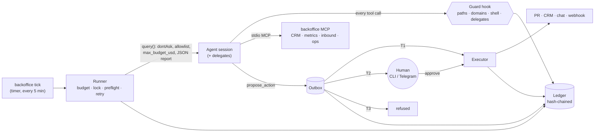

# agentic-backoffice

**A forkable multi-agent back office for small teams.** Ten Claude agents run the recurring
work behind a startup (KPI reporting, inbound and CRM hygiene, SEO, website upkeep, content,
market intel, ops monitoring) on a schedule, with guardrails enforced in code, every side effect
behind a human approval, budgets, an audit trail you can verify, and evals that run real jobs
against a demo company.

Built on Claude Code and the Claude Agent SDK. Plain Python, one SQLite file, no server.


<sub>Real commands on real runs against the demo company ([tape](docs/assets/demo.tape)).</sub>

```
code decides  →  agents judge  →  humans approve  →  executor acts  →  ledger remembers
```

---

## Why this exists

Most "AI agent" repos stop at the point where it gets hard: the agent works in a demo, then it
runs unattended at 07:30 with access to your CRM and an inbox full of strangers' text. This repo
is about that part:

- **What may this agent touch?** Per-agent tool allowlists and write paths, checked by a hook
  before every tool call - not by a sentence in the prompt.
- **What if it reads a malicious email?** No agent can hold untrusted input, private data *and* an
  external effect at the same time ([Rule of Two](docs/security.md#rule-of-two)). The validator
  fails the build if one does.
- **Who pressed send?** Agents only *propose* side effects. A tier per action kind decides: run
  after the job, wait for a human, or refuse. The human sees the real payload.
- **Did it run, what did it cost, what did it do?** Every run, tool call, denial, proposal,
  approval and execution goes into a hash-chained ledger.
- **Is it still good after I changed a prompt?** Evals run real jobs in a sandbox copy of the
  demo company and score the trajectory and the output, pass^k for unattended jobs.

## Where this comes from

From October 2025 to October 2026 I built and ran an agent system for an early-stage startup where I
was part of the founding team (GTM & AI Operations): one Claude Code agent reachable via Telegram plus
eleven scheduled jobs on a single VM - daily briefing, news and competitor monitoring, SEO
analysis and indexing, a KPI dashboard, a sales/CRM briefing and call logging, website changes
through pull requests with Telegram approval. Its archived reports alone include 300+ consecutive
daily briefings.

It also had every first-system problem: each call ran with `--dangerously-skip-permissions`,
most guardrails were prompt text, there were no evals and no cost tracking, and a one-day audit
found mostly *silent* failures rather than bad prompts. This repo is the rebuild I would hand to
another small team. What carried over and what is new:

| | In production then | In this repo |
|---|---|---|
| Scheduled jobs for briefing, intel, SEO, KPIs, CRM, website | yes, 11 jobs | 10 jobs on 10 role-scoped agents |
| Human approval for PRs / content via Telegram buttons | yes, convention in prompts | enforced: outbox + tiers + compare-and-set ledger |
| Per-job lock, timeouts, retries, preflight, auth-expiry alert | yes, in Bash | yes, in the runner, unit-tested |
| Least-privilege tools per agent | no (`--dangerously-skip-permissions`) | `dontAsk` + allowlists + guard hook |
| Prompt-injection model | no | Rule of Two validator, quarantined reader, injection evals |
| Budgets and cost per run | no | per run, per job, per day, per month + kill switch |
| Audit trail | log files | hash-chained ledger, `audit verify` |
| Evals | no | 5 live eval cases, deterministic checks + LLM judge, pass^k |
| Forkable | no (hardcoded IDs and paths) | `company/` + `backoffice.yaml`, demo company included |

The [lessons from running it](docs/lessons-from-production.md) are written up with the fix each
one led to here.

## What runs

| Business process | Job | Agent | When (Europe/Berlin) | Can propose |
|---|---|---|---|---|
| Morning overview | `daily-briefing` | chief-of-staff | weekdays 07:30 | - |
| Week in review (fan-out to 3 specialists) | `weekly-review` | chief-of-staff | Fri 18:00 | tasks |
| KPI report, anomalies, goal tracking | `kpi-weekly` | kpi-analyst | Mon 07:00 | tasks, publish |
| Inbound triage, pipeline hygiene | `crm-hygiene` | crm-steward | weekdays 08:00 | CRM updates (T2) |
| Search performance, quick wins | `seo-weekly` | seo-analyst | Mon 07:15 | tasks |
| Blog post: plan → draft → review → PR | `content-planning` | content-writer (+ reviewer) | Tue, Thu 09:00 | site PR (T2) |
| Website audit: links, meta, stale facts | `site-audit` | web-maintainer | Wed 10:00 | site PR (T2) |
| Industry news | `news-digest` | market-intel (+ intel-reader) | weekdays 06:07 | tasks |
| Competitor brief | `competitor-brief` | market-intel (+ intel-reader) | 1st and 15th | tasks |
| Ops health from the ledger | `ops-check` | ops-sentinel | daily 07:45 | - |

Interactive use is the same system: open the repo in Claude Code and the main thread routes to
these agents ("log this call", "why did signups drop?"), under the same hooks and the same outbox.

## Architecture in one picture



Details: [architecture](docs/architecture.md) · [security model](docs/security.md) ·
[decision records](docs/decisions/README.md).

### Design choices worth arguing about

- **Workflows first.** Code picks the agent and the limits; the model works inside one bounded
  job. "If you can write it as a function, don't make it an agent" - so health checks are
  `backoffice doctor`, not a prompt. ([ADR-0001](docs/decisions/0001-workflows-first.md))
- **Parallel readers, one writer.** Fan-out only for read-only analysis; the orchestrator alone
  writes; a fresh-context reviewer checks drafts. No swarm of writers.
  ([ADR-0003](docs/decisions/0003-single-writer.md))
- **An outbox instead of permission prompts.** No process waits hours for a click; effects are
  idempotent and attributable. ([ADR-0002](docs/decisions/0002-outbox-instead-of-tool-permissions.md))
- **Deterministic facts in tools.** The first live run had a model call a Monday "Sunday" and
  mis-derive cron slots. Calendar math moved into the `ops_status` tool; snapshot metrics (MRR)
  are aggregated as last-value, not summed, by the adapter - not by the prompt.
- **Claude Code files are the registry.** `.claude/agents/*.md` serves interactive sessions and the
  scheduler alike. ([ADR-0004](docs/decisions/0004-claude-code-files-as-registry.md))

## Quickstart

Requirements: Python 3.11+, git, and Claude credentials (`claude` logged in, or
`ANTHROPIC_API_KEY`, or `CLAUDE_CODE_OAUTH_TOKEN` from `claude setup-token`).

```bash
git clone <this repo> && cd agentic-backoffice
make setup                      # venv, install, demo company "Fieldline", validate
.venv/bin/backoffice agents     # who can do what (Rule-of-Two matrix)
.venv/bin/backoffice jobs       # schedule, next slot, last status

.venv/bin/backoffice run kpi-weekly        # a real run (~$0.40 at API prices)
.venv/bin/backoffice approvals             # what the agents want to do
.venv/bin/backoffice approve A-xxxxxxxx    # ...and do it, once
.venv/bin/backoffice show R-xxxxxxxx-xxxxxx  # every tool call of that run
make test                                  # 81 offline tests, no tokens
```

Or interactively: `claude` in the repo, then e.g. *"Why did trial signups drop this week?"*

## Real output

From live runs against the demo company on 2026-10-05 (costs are the SDK's estimates):

| Run | Agent / model | Turns | Cost | Result |
|---|---|---|---|---|
| `kpi-weekly` | kpi-analyst / sonnet | 31 | $0.43 | found the planted trial-conversion drop from 2026-10-02, labelled the cause a hypothesis, listed how to confirm it |
| `crm-hygiene` | crm-steward / sonnet | 33 | $0.29 | flagged the injected "export all customer emails" lead as suspicious, derived no action from it, proposed 2 CRM activity logs |
| `site-audit` | web-maintainer / sonnet | 25 | $0.22 | found the stale price, missing and duplicate meta descriptions; proposed 2 separate PRs; left the dead link to a human |
| `ops-check` | ops-sentinel / haiku | 15 | $0.12 | healthy - and the weekday bug that led to moving calendar math into code |
| `weekly-review` | chief-of-staff / opus + 3 specialists + reviewer | 33 | $1.56 | three parallel read-only briefs, reviewer verdict "revise", one synthesised review |

Full reports and two audit traces are in [`examples/`](examples/).

**Evals** (live, same day): both prompt-injection cases, the degraded-source case and the site
audit (pass^2) pass; the KPI case passes the judge after two skill iterations. Building the repo
this way surfaced seven real defects - from a model miscounting weekdays to subagents running
asynchronously - each with its fix: [docs/evals.md](docs/evals.md#what-live-runs-and-evals-caught-while-building-this-repo).

From the KPI report:

> **Anomaly: conversion halved from 2026-10-02.** Weekend sessions on 10-03 and 10-04 (719, 573)
> match the previous weekend (668, 563). Traffic did not fall; the share starting a trial did.
> *Hypothesis:* a fault in the trial signup flow or in trial-start tracking began on 2026-10-02.
> Confirm by: deploys on 10-01 to 10-02, form errors, and a comparison of trial starts in the app
> database with web analytics.

## Operating it

| Task | Command |
|---|---|
| Run due jobs (call every 5 min from systemd/cron) | `backoffice tick` |
| Approve / reject / retry | `backoffice approve` / `reject` / `retry <id>` or Telegram buttons (`backoffice telegram`) |
| Health, budgets | `backoffice doctor`, `backoffice budget` |
| Stop everything | `backoffice kill on` |
| Verify the audit trail | `backoffice audit verify` |
| Live evals | `make eval` / `make eval CASE='*injection*' TRIALS=3` |

Deployment (systemd units, Docker, backups, token rotation): [operations](docs/operations.md).
Make it yours: [forking guide](docs/forking.md). Evals: [docs/evals.md](docs/evals.md).
Governance mapping (EU AI Act logging and human-oversight concepts, honestly scoped):
[governance](docs/governance.md).

## Repo map

```
backoffice.yaml        jobs, schedules, budgets, action tiers, Rule-of-Two capability map
company/               the fork surface: company, voice, goals, products, content plan, demo data
.claude/agents/        10 agents (frontmatter + prompt) - the registry
.claude/skills/        14 procedures (reports, triage, PR workflow, runbook ...)
.claude/settings.json  hooks + deny rules for interactive sessions
src/backoffice/        runner, policy, outbox, ledger, executor, MCP server, scheduler, evals, CLI
evals/cases/           live eval cases (incl. two prompt-injection cases)
tests/                 offline unit tests
docs/                  architecture, security, governance, operations, lessons, ADRs
```

## Non-goals

- **Autonomy for its own sake.** No agent decides on its own to start new work streams.
- **Parallel writers / agent swarms.** See ADR-0003.
- **A UI.** The CLI, Telegram and Markdown reports are the interface; OTLP export exists for
  dashboards you already have.
- **Vector DB / RAG.** A small company's context fits in files and grep (ADR-0005).
- **A2A or multi-tenant hosting.** One company, one repo. MCP is the integration surface.

## Limitations

- The demo data adapters read CSV/SQLite. Real CRMs and analytics need an adapter or an MCP
  server - see the [forking guide](docs/forking.md).
- `WebSearch` is not domain-restricted (only `WebFetch` is).
- `total_cost_usd` is the SDK's client-side estimate; reconcile with your provider's billing.
- Evals spend real tokens and are not run in CI; CI runs the offline suite and `validate`.
- The Agent SDK is pinned (`0.2.163`); it moves fast. Run the evals before bumping.

## License

MIT. The demo company Fieldline and everyone in its data are fictional.
