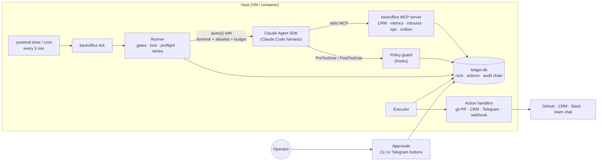
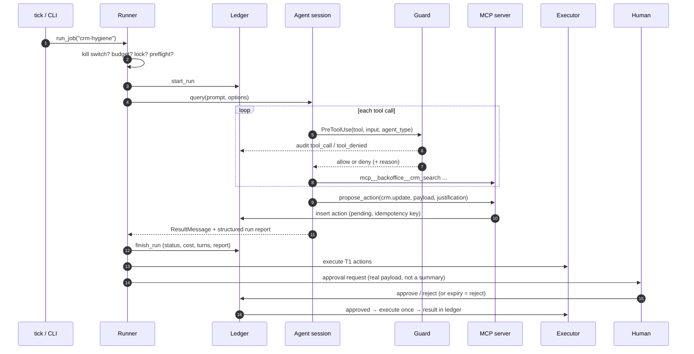

# Architecture

agentic-backoffice is three layers with one rule between them: **code decides, models judge,
humans approve.**

| Layer | Owns | Implemented by |
|---|---|---|
| Control plane | when a job runs, with which agent, limits, retries, budgets, scheduling, audit | `src/backoffice/` (plain Python, ~3.5k lines incl. CLI and evals) |
| Agents | judgement inside one bounded session: read, analyse, write a report, *propose* | `.claude/agents/*.md`, `.claude/skills/*`, Claude Agent SDK |
| Effects | anything visible outside the team: PRs, CRM writes, messages, posts | outbox → approval → `executor.py` → `actions/` |

An agent never holds a credential for an external system and never performs a side effect.
It can only call `propose_action`; whether that proposal runs immediately, waits for a human,
or is refused is decided by the action's tier in `backoffice.yaml`.

## Components



* **Runner** (`runner.py`) builds `ClaudeAgentOptions` from the job and agent definition and runs
  one `query()` per attempt. It is the only place that decides to retry.
* **Policy guard** (`policy.py`, wired by `hooks.py`) runs before every tool call, including calls
  made by subagents, and checks the call against *the acting agent's* declared write paths, web
  domains, shell allowlist and delegates.
* **MCP server** (`mcp_server.py`) is a separate stdio process. Data adapters and their
  credentials live here, so the agent sees results, never connection strings.
* **Ledger** (`ledger.py`) is one SQLite file: `runs`, `actions` (the outbox) and `events`
  (hash-chained audit trail). Agents cannot read or write it; the guard denies the path.
* **Executor** (`executor.py`) performs approved actions exactly once (compare-and-set on the
  action state) and records the result.

## Run lifecycle



Every exit path writes a ledger row: `success`, `failed`, `killed`, `budget_blocked`,
`preflight_failed`, `skipped` (overlap or disabled). "Did the 07:30 briefing run, and why not?"
always has an answer in `backoffice runs`.

## Coordination patterns

The system uses four patterns, each where it fits, rather than one "swarm":

| Pattern | Where | Why |
|---|---|---|
| **Scheduled workflow, single agent** | most jobs (`kpi-weekly`, `crm-hygiene`, `site-audit` ...) | Predictable cost and behaviour. Code picks the agent; the agent does one job. |
| **File-based hand-off** | `news-digest` writes `workspace/reports/intel/`, `daily-briefing` reads it | Jobs stay independent and individually re-runnable; a missing upstream file degrades the briefing instead of breaking it (optional preflight `file:...?`). |
| **Orchestrator-worker, read-only fan-out** | `weekly-review`: chief-of-staff dispatches kpi-analyst, seo-analyst, crm-steward in parallel | Parallel *reading* is where multi-agent pays off. Workers return findings; the orchestrator is the single writer, so there is one set of numbers and one voice. |
| **Fresh-context reviewer** | content-writer → reviewer → revise → propose PR; chief-of-staff → reviewer | A reviewer that did not write the draft catches unsupported claims the author cannot see. |
| **Quarantined reader** | market-intel delegates web reading to intel-reader | The reader touches untrusted web content but has no private data and no effects; it returns a fixed JSON shape. |

Delegation depth is capped at one (`CLAUDE_CODE_MAX_SUBAGENT_SPAWN_DEPTH=1`): specialists do not
spawn their own subagents. Parallel *writers* are deliberately absent; see
[ADR-0003](decisions/0003-single-writer.md).

## Headless and interactive use

The same files serve both modes.

| | Headless (`backoffice run` / `tick`) | Interactive (`claude` in the repo) |
|---|---|---|
| Main agent | the job's agent, prompt appended to the Claude Code preset | the main thread routes to specialists (`CLAUDE.md`) |
| Permissions | `dontAsk` + explicit allowlist (agent tools ∪ delegate tools ∪ `Skill`) | normal Claude Code prompts + `.claude/settings.json` deny rules |
| Guard | per-agent rules (write paths, domains, shell, delegates) via SDK hooks | hard rules only (secrets, ledger, destructive/network shell) via command hooks |
| MCP | `backoffice` only (`strict_mcp_config=True`) | servers enabled in `.mcp.json` |
| Output | structured run report (JSON schema) + files | conversation + files |

Interactive sessions get the lighter guard because a human is watching every step; headless
runs get the strict one because nobody is.

## Failure handling

| Situation | Behaviour | Source |
|---|---|---|
| Run succeeded | never retried (a retry could duplicate side effects) | `Runner._run_session` |
| Transient error (CLI crash, API 5xx, timeout) | retry fresh after back-off, up to `retries` | same |
| `error_max_turns` | resume the same session with 1.5x turns | same |
| `error_max_budget_usd` | stop; a budget stop is a decision, not a glitch | same |
| Auth expired (HTTP 401 on the API call itself) | stop and alert; do not burn retries | same |
| Required source down | `preflight_failed`, no tokens spent | `preflight.py` |
| Optional source down | run *degraded*; the gap is named in the prompt and must appear in `data_gaps` | same |
| Same job already running | `skipped` (per-job file lock) | `job_lock` |
| Proposal repeated by a retry | ignored via idempotency key | `Ledger.propose` |
| Two approvers / two executors | compare-and-set state transitions; the loser gets no change | `Ledger.transition` |
| No approval decision | `expired` after `expire_hours` (fail closed) | `Ledger.expire_overdue` |
| Handler fails | `failed` with error in ledger; operator can `retry` | `executor.py` |

## Data model

```
runs     id, job, agent, trigger, started_at, finished_at, status, subtype, session_id,
         model, cost_usd, num_turns, duration_ms, attempts, degraded, result, error
actions  id, run_id, job, agent, kind, tier, title, payload, justification, idem_key (unique),
         status, created_at, expires_at, decided_at, decided_by, decision_note,
         notified_at, executed_at, result
events   seq, ts, run_id, agent, kind, tool, detail, prev_hash, hash
```

Action states: `pending → approved | rejected | expired`, `approved → executing →
executed | failed`, `failed → approved` (explicit retry). `refused` (T3) has no exits.

## Extension points

* **New agent / skill / job / action kind** - see `AGENTS.md` ("How to add things").
* **Real data sources** - implement the adapters in `data.py` against your CRM / analytics, or
  attach an existing MCP server in `.mcp.json`, list it for the agents that need it, and map its
  tools in `capabilities` so the Rule-of-Two check knows what they are.
* **Approval channel** - implement `request(actions)` (see `approvals/__init__.py`); Slack
  interactive messages would follow the Telegram channel.
* **Telemetry** - set `telemetry.otlp_endpoint`; the Claude Code harness exports OpenTelemetry
  traces, metrics and logs to any OTLP backend (Langfuse, Grafana, SigNoz ...). The ledger stays
  the source of truth for budgets and audit.
